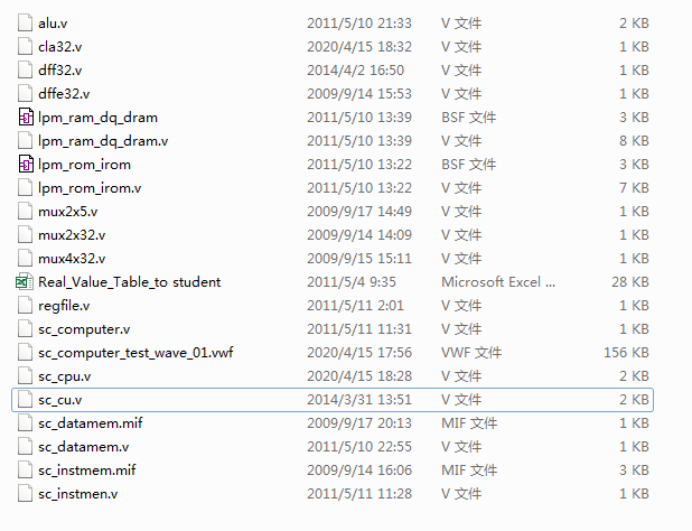

# 单周期CPU模块设计

## 实验要求
1. 采用 Verilog 硬件描述语言在 Quartus II EDA 设计平台中，基于 Intel cyclone II 系列FPGA 完成具有执行 20 条 MIPS 基本指令的单周期 CPU 模块的设计。根据提供的单周期 CPU 示例程序的 Verilog 代码文件， 将设计代码补充完整，实现该模块的电路设计。
2. 利用实验提供的标准测试程序代码， 完成单周期 CPU 模块的功能仿真测试， 验证
CPU 执行所设计的 20 条 RISC 指令功能的正确性。  

**具体要求见[实验要求及参考资料](./实验要求及参考资料)**


## 文件说明
1. 提供的单周期 CPU 模块示例程序源代码包含以下具体文件
      
    其中 sc_computer 为顶层文件，顶层文件代码如下：
    ```verilog
    module sc_computer (resetn,clock,mem_clk,pc,inst,aluout,memout,imem_clk,dmem_clk);
    // 定义顶层模块 sc_computer， 作为工程文件入口input resetn,clock,mem_clk;
    // 定义整个计算机 module 和外界交互的输入信号

    output [31:0] pc,inst,aluout,memout;
    // 模块用于仿真输出的观察信号。缺省为 wire 型。
    output imem_clk,dmem_clk;
    // 模块用于仿真输出的观察信号，用于观察指令 ROM 和数据 RAM 的读写时序。

    wire [31:0] data; //模块间互联传递数据活控制信息的信号线。
    wire wmem; //模块间互联传递数据和控制信息的信号线。

    sc_cpu cpu (clock,resetn,inst,memout,pc,wmem,aluout,data);
    // CPU module.
    // 实例化了一个 CPU，内部包含运算器 ALU 模块，控制器 CU 模块等。
    // 在 CPU 模块的原型定义 sc_cpu 模块中， 可看到其内部的各个模块构成。

    sc_instmem imem (pc,inst,clock,mem_clk,imem_clk);
    // instruction memory.
    // 指令 ROM 存储器 imem 模块。模块原型由 sc_instmem 定义。

    sc_datamem dmem (aluout,data,memout,wmem,clock,mem_clk,dmem_clk );
    // data memory.
    // 数据 RAM 存储器 dmem 模块。模块原型由 sc_datamem 定义。

    Endmodule
    ```

2. 该单周期 sc_computer 由 CPU、 指令 ROM、数据 RAM 共三个模块组成。三个模块之间由定义为 wire 型连接信号线的多路数据连接信号线通过各个模块的输入输出端口（信号） 进行互联。
3. 需要补充的代码文件为alu.v 与 sc_cu.v  
    文件 Real_Value_Table_to student.xls 可协助在设计并补充上面两个代码段时参考使用


## 设计思路
1. ALU部分设计思路  
   * 由计算机组成课程上知识可以知道，ALU在接受不同的控制信号下会进行不同的运算操作。  
   * 在Verilog实现的时候，以此为原理，通过对控制信号二进制值的判断，使其完成不同的操作。  
   * 加减操作，与、或、异或操作可直接用操作符表示。  
   * 逻辑移位操作SRL与SLL也可以直接用<<和>>在Verilog中实现。  
   * 在LUI操作中，需要将立即数左移十六位，即在尾部添加十六个零。  
       这里我采用了级联的语法实现移位操作。值得注意的是，立即数imm是通过ALU的b端输入，因此LUI指令的操作对象应为b而非a

    设计代码如下

    ```verilog
    module alu (a,b,aluc,s,z);
    input [31:0] a,b;
    input [3:0] aluc;
    output [31:0] s;
    output        z;
    reg [31:0] s;
    reg        z;
    always @ (a or b or aluc) 
        begin                                   // event
            casex (aluc)
                4'bx000: s = a + b;              //x000 ADD
                4'bx100: s = a - b;              //x100 SUB
                4'bx001: s = a & b;              //x001 AND
                4'bx101: s = a | b;              //x101 OR
                4'bx010: s = a ^ b;              //x010 XOR
                4'bx110: s = {b[15:0],16'b0};    //x110 LUI: imm << 16bit             
                4'b0011: s = b << a;             //0011 SLL: rd <- (rt << sa)
                4'b0111: s = b >> a;             //0111 SRL: rd <- (rt >> sa) (logical)
                4'b1111: s = $signed(b) >>> a;   //1111 SRA: rd <- (rt >> sa) (arithmetic)
                default: s = 0;
            endcase
            if (s == 0 )  z = 1;
                else z = 0;         
        end      
    endmodule 
    ```


2. CU部分设计思路  
    * 首先基于MIPS三类指令 R型，I型，J型的特点，可以通过代码的opcode和func部分判断出具体的指令类型。R型指令需要opcode和func部分联合判断，I型和J型指令则只需通过opcode判断，这样就确定出了各指令。
    * 而控制信号的确定则是建立在对各个MIPS指令的操作过程的熟悉。利用提供的真值表，在补全空缺信息后即可确定各控制信号与指令的联系
    
    设计代码如下

    ```verilog
    module sc_cu (op, func, z, wmem, wreg, regrt, m2reg, aluc, shift,
              aluimm, pcsource, jal, sext);
   input  [5:0] op,func;
   input        z;
   output       wreg,regrt,jal,m2reg,shift,aluimm,sext,wmem;
   output [3:0] aluc;
   output [1:0] pcsource;
   wire r_type = ~|op;
   wire i_add = r_type & func[5] & ~func[4] & ~func[3] &
                ~func[2] & ~func[1] & ~func[0];          //100000
   wire i_sub = r_type & func[5] & ~func[4] & ~func[3] &
                ~func[2] &  func[1] & ~func[0];          //100010
      
   //  please complete the deleted code.
   
   wire i_and = r_type & func[5] & ~func[4] & ~func[3] &
                func[2] & ~func[1] & ~func[0];   //100100
   wire i_or  = r_type & func[5] & ~func[4] & ~func[3] &
                func[2] & ~func[1] & func[0];   //100101

   wire i_xor = r_type & func[5] & ~func[4] & ~func[3] &
                func[2] & func[1] & ~func[0];   //100110
   wire i_sll = r_type & ~func[5] & ~func[4] & ~func[3] &
                ~func[2] & ~func[1] & ~func[0];   //000000
   wire i_srl = r_type & ~func[5] & ~func[4] & ~func[3] &
                ~func[2] & func[1] & ~func[0];   //000010
   wire i_sra = r_type & ~func[5] & ~func[4] & ~func[3] &
                ~func[2] & func[1] & func[0];   //000011
   wire i_jr  = r_type & ~func[5] & ~func[4] & func[3] &
                ~func[2] & ~func[1] & ~func[0];   //001000
                
   wire i_addi = ~op[5] & ~op[4] &  op[3] & ~op[2] & ~op[1] & ~op[0]; //001000
   wire i_andi = ~op[5] & ~op[4] &  op[3] &  op[2] & ~op[1] & ~op[0]; //001100
   
	// complete by yourself.
   wire i_ori  = ~op[5] & ~op[4] &  op[3] &  op[2] & ~op[1] &  op[0]; //001101        
   wire i_xori = ~op[5] & ~op[4] &  op[3] &  op[2] &  op[1] & ~op[0]; //001110  
   wire i_lw   =  op[5] & ~op[4] & ~op[3] & ~op[2] &  op[1] &  op[0]; //100011  
   wire i_sw   =  op[5] & ~op[4] &  op[3] & ~op[2] & ~op[1] & ~op[0]; //101011
   wire i_beq  = ~op[5] & ~op[4] & ~op[3] &  op[2] & ~op[1] & ~op[0]; //000100
   wire i_bne  = ~op[5] & ~op[4] & ~op[3] &  op[2] & ~op[1] &  op[0]; //000101
   wire i_lui  = ~op[5] & ~op[4] &  op[3] &  op[2] &  op[1] &  op[0]; //001111
   wire i_j    = ~op[5] & ~op[4] & ~op[3] & ~op[2] &  op[1] & ~op[0]; //000010
   wire i_jal  = ~op[5] & ~op[4] & ~op[3] & ~op[2] &  op[1] &  op[0]; //000011
   
  
   assign pcsource[1] = i_jr | i_j | i_jal;
   assign pcsource[0] = ( i_beq & z ) | (i_bne & ~z) | i_j | i_jal ;
   
   assign wreg = i_add | i_sub | i_and | i_or   | i_xor  |
                 i_sll | i_srl | i_sra | i_addi | i_andi |
                 i_ori | i_xori | i_lw | i_lui  | i_jal;
					
   // complete by yourself.
   assign aluc[3] = i_sra;     
   assign aluc[2] = i_sub | i_or | i_srl | i_sra | i_ori | i_beq | i_bne | i_lui;
   assign aluc[1] = i_xor | i_sll | i_srl | i_sra | i_xori | i_lui;
   assign aluc[0] = i_and | i_or | i_sll | i_srl | i_sra | i_addi | i_ori;
   assign shift   = i_sll | i_srl | i_sra ;
	
	// complete by yourself.
   assign aluimm  = i_addi | i_andi | i_ori | i_xori | i_lw | i_sw | i_lui;     
   assign sext    = i_addi | i_lw | i_sw | i_beq | i_bne;
   assign wmem    = i_sw;
   assign m2reg   = i_lw; 
   assign regrt   = i_addi | i_andi | i_ori | i_xori | i_lw | i_lui; 
   assign jal     = i_jal;

    endmodule
    ```

## 实验结果
**整体理解，实验结果见[实验报告及补充代码](./实验报告及补充代码)**