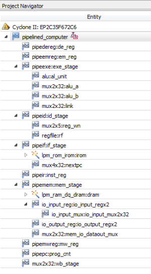

# 五级流水线CPU模块设计

## 实验要求
1. 完成五级流水线CPU核心模块的设计
2. 完成对五级流水线CPU的仿真，仿真测试程序应该具有与实验一提供的标准测试程序代码相同的功能。 对两种CPU实现核心处理功能的过程和设计处理上的区别作对比分析。
3. 完成流水线CPU的IO模块仿真，对两种CPU实现相同IO功能的过程和设计处理上
的区别作对比分析

**具体要求见[实验要求及参考代码](./实验要求及参考代码)**

## 文件说明
1. 实验设计的顶层主要代码模块，分别是 5 个流水段的 module、以及五级流水段之间的 4 个流水线寄存器 module，外加 1 个程序计数器 module（也可以当作为最前面一级流水段的输入流水线寄存器），共计 10 个 module。
2. 项目最终层次结构图如下所示  

    
3. 其中 pipelined_computer 为顶层文件，顶层文件代码如下：

    ```verilog
    module pipelined_computer (resetn,clock,mem_clock,opc,oinst,oins,oealu,omalu,owalu,onpc,in_port0,in_port1,out_port0,out_port1,out_port2,out_port3);
    //定义顶层模块 pipelined_computer，作为工程文件的顶层入口，如图 1-1 建立工程时指
    input resetn,clock/*,mem_clock*/;
    output mem_clock;
    assign mem_clock = ~clock;	
    //定义整个计算机 module 和外界交互的输入信号 包括复位信号 resetn、时钟信号 clock、
        //以及一个和 clock 同频率但反相的 mem_clock 信号。 mem_clock 用于指令同步 ROM 和数据同步 RAM 使用，其波形需要有别于实验一。
        //这些信 号 可 以 用 作 仿 真验 证时 的 输 出 观 察 信 号
    input  [5:0] in_port0,in_port1;
    output [31:0] out_port0,out_port1,out_port2,out_port3;// output [6:0] out_port0,out_port1,out_port2,out_port3;
    
    wire [31:0] real_out_port0,real_out_port1,real_out_port2,real_out_port3;
    
    wire [31:0] real_in_port0 = {26'b00000000000000000000000000,in_port0};
    wire [31:0] real_in_port1 = {26'b00000000000000000000000000,in_port1};
    
    assign out_port0 = real_out_port0[31:0];//assign out_port0 = real_out_port0[6:0];
    assign out_port1 = real_out_port1[31:0];//assign out_port0 = real_out_port1[6:0];
    assign out_port2 = real_out_port2[31:0];//assign out_port0 = real_out_port2[6:0];
    assign out_port3 = real_out_port3[31:0];//assign out_port0 = real_out_port3[6:0];
    //IO 口 的定义，宽度可根据自己设计选择。
    
    wire [31:0] pc,ealu,malu,walu;
        output [31:0] opc,oealu,omalu,owalu;// for watch
        assign opc = pc;
        assign oealu = ealu;
        assign omalu = malu ;
        assign owalu = walu ;
        
    output [31:0] onpc,oins,oinst;// for watch
        assign  onpc=npc;
        assign  oins=ins;
        assign  oinst=inst;
        //模块用于仿真输出的观察信号。缺省为 wire 型。 为了 便于观察 内部 关键 信号 将其 接到
        //输出管脚 。 不输出也一样，只是仿真时候要从内部信号 里 去寻找。
        
    wire   [31:0] bpc,jpc,pc4,npc,ins,inst;
    //模块间互联传递数据或控制信息的信号线 ,均为 32 位宽信号。 IF 取指令阶段。
    wire   [31:0] dpc4,da,db,dimm,dsa;
    //模块间互联传递数据或控制信息的信号线 ,均为 32 位宽信号。 ID 指令译码阶段。
    wire   [31:0] epc4,ea,eb,eimm,esa;
    //模块间互联传递数据或控制信息的信号线 ,均为 32 位宽信号。 EXE 指令运算阶段。
    wire   [31:0] mb,mmo;
    //模块间互联传递数据或控制信息的信号线 ,均为 32 位宽信号。 MEM 访问数据阶段。
    wire   [31:0] wmo,wdi;
    //模块间互联传递数据或控制信息的信号线 ,均为 32 位宽信号。 WB 回写寄存器阶段。
    wire   [4:0] ern0,ern,drn,mrn,wrn;
    //模块间互联,通过流水线寄存器传递结果寄存器号的信号线,寄存器号(32个)为5bit。
    wire   [4:0] drs,drt,ers,ert;
    // 模块间互联,通过流水线寄存器传递rs 、rt寄存器号的信号线,寄存器号(32个)为5bit。
    wire   [3:0] daluc,ealuc;
    //ID 阶段向 EXE 阶段通过流水线寄存器传递的 aluc 控制信号， ，4bit。
    wire   [1:0] pcsource;
    //CU 模块向 IF 阶段模块传递的 PC 选择信号， ，2bit。
    wire         wpcir;
    // CU 模块发出的控制流水线停顿的控制信号，使 PC 和 IF/ID 流水线寄存器保持不变。
    wire         dwreg,dm2reg,dwmem,daluimm,dshift,djal;  //id stage
    // ID 阶段产生，需往后续流水级传播的信号。
    wire         ewreg,em2reg,ewmem,ealuimm,eshift,ejal;  //exe stage
    //来自于 ID/EXE 流水线寄存器， EXE 阶段使用，或需要往后续流水级传播的信号。
    wire         mwreg,mm2reg,mwmem;  //mem stage
    //来自于 EXE/MEM 流水线寄存器， MEM 阶段使用，或需要往后续流水级传播的信号。
    wire         wwreg,wm2reg;  //wb stage
    //来自于 MEM/WB 流水线寄存器， WB 阶段使用的信号。
    wire         ezero,mzero;  
    //模块间 互 联 通 过 流 水线 寄存 器 传 递 的 zero 信 号 线
    wire ebubble,dbubble;
    //模块间 互 联 通 过 流 水线 寄存 器 传 递 的 流水线 冒险处理 bubble 控制 信 号 线
    
    pipepc   prog_cnt(npc,wpcir,clock,resetn,pc);
    //程序计数器模块，是最前面一级 IF 流水段的输入。
        
    pipeif   if_stage(pcsource,pc,bpc,da,jpc,npc,pc4,ins,mem_clock);  // IF stage
    //IF 取指令模块 注意其中包含的指令同步 ROM 存储器的同步信号
        //即输入给该模块的 mem_clock 信号 模块内定义为 rom_clk。 // 注意 mem_clock。
        //实验中可采用系统 clock 的反相信号作为 mem_clock（亦即 rom_clock））,
        //即留给信号半个节拍的传输时间。
        
    pipeir   inst_reg(pc4,ins,wpcir,clock,resetn,dpc4,inst);  // IF/ID 流水线寄存器
    //IF/ID 流水线寄存器模块，起承接 IF 阶段和 ID 阶段的流水任务。
        //在 clock 上升沿时，将 IF 阶段需传递给 ID 阶段的信息，锁存在 IF/ID 流水线寄存器中，并呈现在 ID 阶段。
        
    pipeid   id_stage(mwreg,mrn,ern,ewreg,em2reg,mm2reg,dpc4,inst,ins,
                        wrn,wdi,ealu,malu,mmo,wwreg,mem_clock,resetn,
                        bpc,jpc,pcsource,wpcir,dwreg,dm2reg,dwmem,daluc,
                        daluimm,da,db,dimm,dsa,drn,dshift,djal,mzero,
                        drs,drt/*,npc*/,ebubble,dbubble);  // ID stage
        //ID 指令译码模块。注意其中包含控制器 CU、寄存器堆、及多个多路器等。
        //其中的寄存器堆，会在系统 clock 的下沿进行寄存器写入，也就是给信号从 WB 阶段
        //传输过来留有半个 clock 的延迟时间，亦即确保信号稳定。
        //该阶段 CU 产生的、要传播到流水线后级的信号较多。
        
    pipedereg de_reg(dbubble,drs,drt,dwreg,dm2reg,dwmem,daluc,daluimm,da,db,dimm,dsa,drn,dshift,djal,dpc4,clock,resetn,
                        ebubble,ers,ert,ewreg,em2reg,ewmem,ealuc,ealuimm,ea,eb,eimm,esa,ern0,eshift,ejal,epc4);  // ID/EXE 流水线寄存器
    //ID/EXE 流水线寄存器模块，起承接 ID 阶段和 EXE 阶段的流水任务。
        //在 clock 上升沿时，将 ID 阶段需传递给 EXE 阶段的信息，锁存在 ID/EXE 流水线寄存器中，并呈现在 EXE 阶段。
        
    pipeexe  exe_stage(ealuc,ealuimm,ea,eb,eimm,esa,eshift,ern0,epc4,ejal,ern,ealu
                        /*,ezero,ert,wrn,wdi,malu,wwreg*/);  //EXE stage
    //EXE 运算模块。其中包含 ALU 及多个多路器等。
        //这里人工注释掉了不用的信号线
        
    pipeemreg em_reg(ewreg,em2reg,ewmem,ealu,eb,ern,ezero,clock,resetn,
                        mwreg,mm2reg,mwmem,malu,mb,mrn,mzero);  //EXE/MEM 流水线寄存器				
    //EXE/MEM 流水线寄存器模块，起承接 EXE 阶段和 MEM 阶段的流水任务。
        //在 clock 上升沿时，将 EXE 阶段需传递给 MEM 阶段的信息，锁存在 EXE/MEM流水线寄存器中，并呈现在 MEM 阶段。
        
    pipemem mem_stage(mwmem,malu,mb,clock,mem_clock,mmo,resetn,
                        real_in_port0,real_in_port1,real_out_port0,real_out_port1,real_out_port2,real_out_port3);  // MEM stage
    //MEM 数据存取模块。其中包含对数据同步 RAM 的读写访问。 // 注意 mem_clock。
        //输入给 该同步 RAM 的 mem_clock 信号，模块内定义为 ram_clk。
        //实验中可采用系统 clock 的反相信号作为 mem_clock 信号（亦即 ram_clk））,
        //即留给信号半个节拍的传输时间，然后在 mem_clock 上沿时，读输出、或写输入。
        
    pipemwreg mw_reg(mwreg,mm2reg,mmo,malu,mrn,clock,resetn,
                        wwreg,wm2reg,wmo,walu,wrn);  // MEM/WB 流水线寄存器
        //MEM/WB 流水线寄存器模块 起承接 MEM 阶段和 WB 阶段的流水任务。
        //在 clock 上升沿时 将 MEM 阶段需传递给 WB 阶段的信息 锁存在 MEM/WB
        //流水线寄存器中，并呈现在 WB 阶段。
        
    mux2x32 wb_stage(walu,wmo,wm2reg,wdi);  // WB stage
    //WB 写回阶段模块。事实上，从设计原理图上可以看出，该阶段的逻辑功能部件只
        //包含一个多路器，所以可以仅用一个多路器的实例即可实现该部分。
        //当然，如果专门写一个完整的模块也是很好的。
        
    endmodule
    ```

## 设计思路

这一部分依次按照流水线五个流水段的顺序进行说明
1. 首先是程序计数器pipepc，可以将其看作最前面一级流水段的输入流水线寄存器。该模块的功能是将pc值更新为下一个新的pc。此外，考虑到reset信号的置零控制以及lw指令下特殊数据冒险的停顿控制。
2. 接下来是取指pipeif流水段。该模块的功能是取指令并确定pc的下一个值。与单周期相同的地方是都有通过irom取指令，不同的地方是多了一个四路选择器。根据pcsource判断有无跳转来确定下一个pc。在单周期中是放在mem阶段进行的，在流水线中为了降低冒险带来的损失将其前移到pipeif阶段。然而，在面临跳转相关的控制冒险时，依然需要再插入一条空指令来避免出错。通过pcsource来判断，当其为00时是PC+4，其余都是跳转相关指令，因此均通过硬件实现空指令的插入。
3. 接下来是if与id段之间的流水线寄存器pipeir。该寄存器将pc4与ins传递至id段。与pipepc类似，同样有reset和wpcir参与控制。
4. 接下来是pipeid流水段。该模块的功能包括cu控制单元，寄存器堆，以及两个解决数据冒险的直通处理选择器。这部分与单周期CPU的不同是多了对数据冒险的直通处理，而其他信号的处理和单周期相同。在数据冒险的处理中，需要考虑三种直通情况，分别是ex段末尾的alu输出端；mem末尾的alu输出端和mem末尾的存储器输出端。前两种情况可以完全通过直通选择的方式解决，而最后一种情况与lw相关，不仅需要直通，还需要插入停顿周期。Wpcir信号即用来处理该情况，当wpcir信号为0时，所有其他信号均置零，同时pc也暂停更新一次。
5. 而直通信号处理模块forward则是根据结构图设计。没有数据冒险时fwda信号为00，ex段末尾的alu输出端fwda信号为01，mem末尾的alu输出端fwda信号为10，mem末尾的存储器输出端fwda信号为11。
6. 剩下的三个流水线寄存器pipedereg，pipeemreg和pipemwreg功能是相同的，都是将前一段的信号锁存并在时钟沿传递至下一段，而要传递的信号种类与结构图一致。只需要额外注意在resetn信号为0时保持为零即可。
7. 最后是pipeexe流水段pipemem流水段(writeback流水段仅包括一个二路多选器在此忽略)。基本上和单周期设计一致。变动的地方是exe段有一个pc+4的操作，mem段因为存储器时钟和主时钟反向，信号的确定以存储器时钟为准即可。

## 实验结果
**整体理解，实验结果见[实验报告及补充代码](./实验报告及补充代码)**