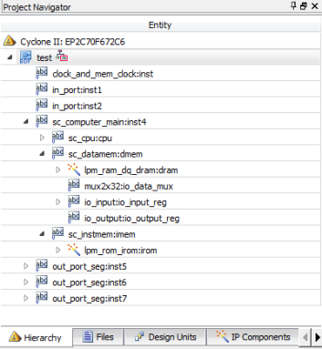

# 单周期CPU模块IO设计

## 实验要求
1. 采用 Verilog 硬件描述语言在 Quartus II EDA 设计平台中，基于 Intel cyclone II 系列 FPGA完成具有执行 20 条 MIPS 基本指令的单周期 CPU 的输入输出部件亦即 IO 接口扩展模块设计。 在之前提供并自行补充已完成的单周期 CPU 模块基础上， 添加对 IO 的内部相应处理并添加 IO 接口模块， 实现 CPU 对外设的 IO 访问。
2. 利用实验提供的标准测试程序代码， 对单周期 CPU 的 IO 模块进行功能仿真测试
3. 自行设计添加一条新的 CPU 指令，修改 CPU 控制部件和执行部件模块代码，支持新指
令的操作，并通过仿真验证功能的正确性

**具体要求见[实验要求及参考代码](./实验要求及参考代码)**

## 文件说明

1. 文件和第一次实验大部分相同，增加了两个输入端口和三个输出端口。同时对sc_datamem.v 进行了改写， 一是增加了 IO 端口声明， 二是内部添加了子模块 io_input，io_output， 用于完成对 IO 地址空间的译码， 以及构成 IO 和 CPU 内部之间的数据传输通道。另外还增加了一个选择数据来源的 mux 模块
2. 相应的，顶层模块 sc_computer 也要做对应的修改，增加对新加的 IO 的端口声明， 并在例化 sc_datamem 模块的时候对新加的 IO 参数要添加与之连接的信号
3. 同时还增加了一个 clk_and_mem_clk， 其功能是采用一个 clk 作为主时钟输入， 在内部给出二分频后作为 CPU 模块的工作时钟，并产生 mem_clk， 用于对 CPU 模块内含的存储器读写控制。
4. 项目最终层次结构图如下所示  

     

## 设计思路
* IO模块设计思路
  * 输入端口  
    从提供的仿真结果可以看出，输入为两个五位二进制的数，即总共有十个位输入，从SW0到SW9。此外，还有reset控制信号以及总的时钟信号。因为CPU需要的是32位的输入，所以要将两个五位的输入转换为32位，通过模块in_port.v实现，即在两个输入前补零输入的reset信号可以直接传递到子模块，而时钟信号则要进行二分频转换得到另一个信号共同作用控制CPU内部执行。则通过总时钟信号的上升沿判断，每次上升沿即翻转信号，由此得到二分频时钟，具体代码见clock_and_mem_clock.v文件。
  * 输出端口  
    IO设备的输出通过三个output port端口。按照仿真图的信息，不需要对其额外的处理。但根据任务要求，在这里对其进行十进制转换并通过七段译码器输出。首先通过取余和除十对输出数据进行算术运算得到其十位数与个位数。以个位数为例，它现在是四位表示的二进制数，对其进行case的switch，根据不同的数值与七段LED显示进行对应得到一个七位的输出代表七个输出指示灯的亮暗状态。具体代码见out_port_seg.v文件
  * 数据存储器  
    这一部分主要是参看提供的参考代码。对存储器增加了两个32位输入端口以及三个32位输出端口。通过对地址第八位的判断来确定输出数据是来源于内部存储器还是IO。当数据由IO输入至CPU时，首先将两个输入口的数据传输至两个对应的寄存器，再通过指令值判断输入寄存器号是0还是1，最后通过某一寄存器传输至CPU。当数据由CPU输出至IO时，同样通过指令值判断输出端口。这一部分与参考代码一致，唯一不同的是在输出模块中添加了reset信号，当reset信号为0时，三个输出端口的值置为零，修改代码见io_output.v文件

* 新指令设计思路

    * 在CPU内部设计阶段，主要修改的是alu.v文件以及cu.v文件。在alu中，对新的指令设计一个新的四位控制信号，通过对控制信号筛选，当信号对应该指令时，利用Verilog实现功能。例如在求hamming距离时，先对输入alu的两个数进行异或操作，再将各位数相加就求出了汉明距离。在cu中，增加新指令对应的六位opcode。同时修改aluc信号包含的指令，包括wreg信号对应的指令。自此即完成新指令的设计阶段
    * 对新设计的求hamming距离指令，我设计的指令格式为 hamm $7, $4, $5,其op码为000000，func码为000001，aluc的控制信号为1011.该指令设计属于R型指令，其三十二位指令码为000000 00100 00101 00111 000001。在IO模块的基础上需要修改的包括三个文件，alu.v，cu.v以及instmem.mif文件。alu.v和cu.v文件的修改与上文思路一致，具体代码附在文件夹中。mif文件的修改可通过Quartus修改，将三十二位的指令码每四个一组，转换为八位即00853801，插入到mif中作为一条新的指令。同时，由于新指令的加入，mif文件中的宽度DEPTH也要增加，这里从16增至64.

## 实验结果
**整体理解，实验结果见[实验报告及补充代码](./实验报告及补充代码)**