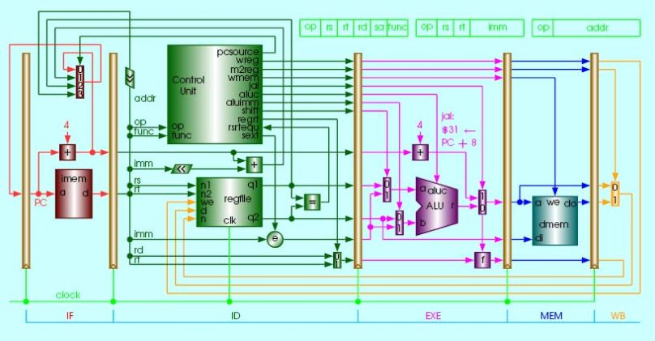

# 处理器

* 寄存器堆  
    * 运算方式：只有reg到reg可进行算术操作ALU  
    而reg到mem时，ALU只能做地址运算，不能进行算术运算  
    * Register write和memory write会在下一个周期开始时执行  
    寄存器写入时，若采用flip-flop，会在上升沿开始工作，即下个周期开始时
    若用Latch，电平控制，会在高电平将寄存器读出冻结，即在当前周期结尾

* CPU与存储器  
一条指令下，所有部件均执行一次，除了寄存器存或取了两次  
(即存一次读一次，因为可一次性读出两个值)  
PC也只执行了一次，因为其输出始终存在，执行一次是更新状态  
Register：时序逻辑(flip-flop)  ALU：组合逻辑(与或非)  
ALU有输出z，当输出全为零时，该通口置为1(会结果进行判断，组合电路)  
4个bit指令操纵ALU，即其最多有16种操作运算  
  * 为什么有两个memory，指令与数据memory？  
    Instruction memory不是IR，它只能读不能写。最早通过三总线从memory读取时，指令与数据分开读取，相当于操作了两次。而现在高速缓存cache的存在，部分cache专门存指令，对高速缓存读写相当于对memory读写，使得图中看起来有多个memory

* 流水线
    * 概念  
    流水线不会改变每一个任务的执行时间，提升的是整个系统任务执行的吞吐率  
    流水线的吞吐率取决于最慢的流水环节  
    流水线的每一个步骤完成一条指令的一部分  
    不同的步骤并行完成不同指令的不同部分，连续指令流  
    每一个步骤称为一个流水节拍或一个流水段  
    指令沿流水线移动一次的时间间隔就是一个机器周期，一个stage的时间  
    * 评价  
    单周期工作频率由所有指令中耗时最长的那一条决定  
    设计目标是平衡各个流水段的长度  
    若每一步都得到最佳平衡，则每条指令在流水线上的平均时间为
    单周期一条指令的执行时间/流水线分段数  
    流水线减少指令平均执行时间，可看作减少CPI或时钟周期长度
    * 分段方式
        * 将一条典型的MIPS指令分为五段
          1. IF(Instruction Fetch)：从内存中读指令
          2. ID(Instruction Decode)：指令译码的同时读取寄存器  
              MIPS设计允许指令译码与读取寄存器同时进行
          3. EX(Execute)：执行操作或计算地址
          4. MEM(Memory access)：在数据存储器中读取操作数
          5. WB(Write Back)：将结果写回寄存器  

        
    * 特点  
    会对指令之间的依赖关系产生影响  
    若需要读取刚写入寄存器的数据，需要隔开两个指令周期
    * PC+4的加法器为什么放在IF阶段运行？  
    因为传回来的更新值会待在多选器，不会立即更新PC的值。直到下个周期开始时，才和跳转地址进行选择。
    * 为什么跳转地址线要在MEM阶段而不是直接在EX段送到多选器待选？  
    跳转的指令需要知道ALU计算出zero的值，再判断是否产生跳转。而ALU计算在EX最后完成，MEM段才能确定，因而从MEM段绕过。
    * 分段实现  
    在各段之间加入流水线分割/缓存寄存器—流水线寄存器 flip-flop  
    作用：隔离并传递数据和控制信息  
    在每个时钟周期结束后，该段的所有执行结果都保存在流水线寄存器中，在下一个时钟周期作为下一个段的输入。
    * 注意事项  
    寄存器组可以一个周期内读一次写一次，否则WB后要再加一个流水段  
    寄存器的写入不是组合逻辑，其操作与流水线寄存器上升沿对齐  
    此外芯片设计时流水线寄存器之间的部分都是组合逻辑。  
    Mem均可想象为组合逻辑，但实现时，图上两个memory是时序逻辑  
    即使是当前阶段不用的信息，依然要锁存延迟，不能直接传到下一段  
    而后级流水段可以向前级反馈数据和控制信息  

    * 流水线冒险  
      1. 结构冒险(抢资源)  
      例如，在某一个周期内对存储器同时有指令和数据access  
      解决方法：memory可以同时存或取两次即双端口  
      或者进行停顿，直到所需的功能单元能够使用为止  
      停顿通常称为流水气泡或气泡，插入NOP指令空转，所有流水线后推
      2. 数据冒险(指令间的依赖)  
      后面指令要用到上一条指令的结果  
      例如 DADD R1,R2,R3    DSUB R4,R1,R5 两条连续指令  
      解决方法：加入气泡，但引入延迟  
      或者通过直通(旁路)，直接把DADD的结果从EX/MEM寄存器直接在下一个周期传送到DSUB需要的地方,即ALU输入锁存器，然后ALU通过判断在寄存器堆和直通结果中选择更加新的一个值
      3. 控制冒险(跳转指令)  
        通过把判零检测和地址计算前移到ID段来缩短转移冒险引起的停顿  
        调度方法：  
           * 最简单的方法：冻结或冲刷流水线
           * 对所有的转移都按未选中处理
           * 预测转移被选中
           * 采用转移延迟（添加延迟槽branch delay slot） 
