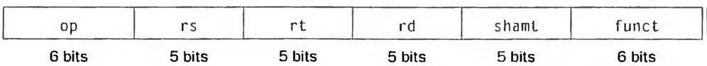
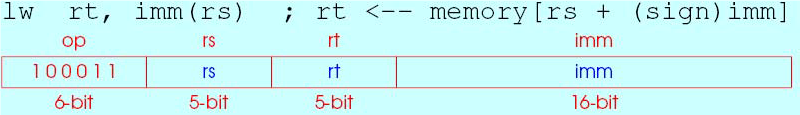
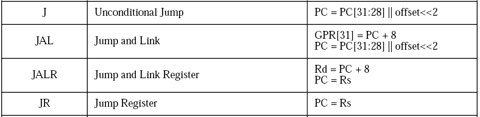
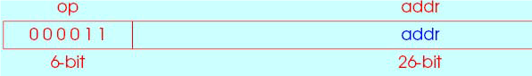
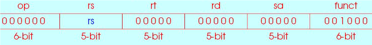
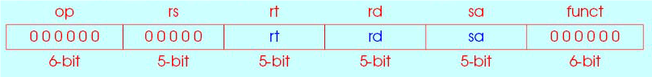

# 指令系统

* 指令集实例(MIPS架构)  
    32根地址线，能够寻址2^30 memory words，因为一个word是四个字节  
    Load：from memory to register  
    Store：word from register to memory  
    做加法时，结果不能放进内存，而是应该存到寄存器  
    $之后接两个字符代表一个寄存器  
    操作中存在对有符号与无符号的区分  

* 计算机硬件的操作数  
运算操作数可来自多处，(R, M, I/O)(s, d箭头两端随意)，但硬件只选有限方式

  * MIPS的操作数设计为只能来自于寄存器(x86的操作数可直接来自内存)
  * 寄存器(Register)：位于CPU内，离运算器最近、具有最快访问速度的存储器。  
    寄存器对程序员可见
  * 寄存器并不是越多越好？  
    大量寄存器可能使时钟周期变长，访问速度下降。因为需要更远的电信号传输距离


* 数据传输指令  
由于MIPS的算术运算只对寄存器操作，因此MIPS需要包含在存储器与寄存器之间传送数据的指令。  
MIPS是按字节编址的，一个字四字节，因此字的起始地址必须是四的倍数
  * 取数指令(load)
    * C语言描述：A[12] = h + A[8]；
    * MIPS指令：lw \$t0, 32(\$s3)
    * A[8]表示第八个字，因此从存储器中数组的首地址偏移八个字的长度即32
  * 存数指令(store)
    * sw \$t0, 48(\$s3)  # \$t0的值，存入48+\$s3寄存器值所指的主存单元。
  * 字节寻址两种类型(PPT4a P21  3.30)
    * Big-Endian or Little-Endian 小端，大端
    * 大端时，数据最左边为起始地址。小端相反
    * x86、ARM是小端，MIPS、Power PC是大端

* 常数或立即操作数
    * 例如要使寄存器\$s3+4，假设\$s1+Addrconstant4是常量4的存储地址
        ```
        lw $t0, AddrConstant ($s1)  # $t0 = constant 4
        add $s3, $s3, $t0  # $s3 = $s3 + $t0 ($t0 == 4) 
        ```

        那么此时也可以用加立即数指令来实现快速加法  
        ```addi $s3, $s3, 3  # $s3 = $s3 + 3```

    * AddrConstant的范围和加立即数的范围哪个大？  
    AddrConstant更大，因为该操作是从存储器取值，取到的值为32位。而RISC架构下指令为定长四字节，加立即数操作总共占32位，故加上的值的位数小于32位，范围会小一些。
    * MIPS的0号寄存器，通过硬件设置为恒0  
    利用加法指令与0号寄存器实拷贝操作

* CISC向RISC的过渡
    * 起源  
    典型程序中，大约80%的语句仅仅使用处理机中20%的指令。  
    执行频度高的简单指令，因复杂指令的存在，在实现中，难以提高执行速度。  
    最小周期受到复杂指令的限制  
    * RISC（ Reduced Instruction Set Computer ）的主要特征
        * 选用使用频度较高的一些简单指令来构成指令集，复杂指令的功能通过由简单指令的组合来实现；
        * 指令长度固定、指令格式种类少、寻址方式少；
        * 只有LOAD/STORE指令访存；
        * CPU中有多个通用寄存器；
        * 采用流水技术，一个时钟周期完成成一条指令；
        * 采用组合逻辑实现控制器；
        * 采用优化的编译程序。
    * CISC （Complex Instruction Set Computer）的主要特征
        * 指令系统复杂庞大，各种指令使用频度相差大；
        * 指令长度不固定、指令格式种类多、寻址方式多；
        * 访存指令不受限制；
        * CPU中多为专用寄存器；
        * 大多数指令需要多个时钟周期才能执行完毕；
        * 采用微程序控制器实现控制；
        * 难以采用优化编译程序生成高效的目标代码。
    * RISC和CISC的比较
        * RISC更能充分利用VLSI芯片的面积；
        * RISC更能提高计算机运算速度
        * 指令数少，指令格式少，寻址方式少，通用寄存器多，采用组
        合逻辑控制，便于实现指令流水
        * RISC便于设计，可降低成本，提高可靠性
        * RISC有利于编译程序代码优化

* 有符号与无符号数  
    最低有效位：在MIPS字中最右边的一位 （最左边为最高有效位）  
    利用2的补码区分符号  
    对无符号数的运算指令名后有u  
    最高有效位为1时代表负数，首项乘-2^31，其余正常计算  
    * 取反的方法：  
        对每一位取反，然后对结果加1
    * 符号扩展：   
        将16位扩展成32位时，将最高有效位拷贝16次放到32位字的左半部
    * 一个二进制的值，需要知道其位数，符号等条件才能完全确定  
    例如1100,1100 与 0100,1100哪个更大？  
    需要知道位数，若为8位，则后者更大，因为0开头为正  
    若为16位，则前者更大，因为开头均有八个零

    * 取数时也存在专门针对无符号数的操作(lb, lbu)  
    对于寄存器从memory中拿一个字节时，若有符号，需要扩展为32位  
    如果是无符号数，lbu指令表示直接拿来不进行扩展

* 计算机指令的表示  
    * 例如指令```add $t0, $s1, $s2```  
    其十进制表示为 0  17  18  8  0  32  
    第一个与最后一个字段告诉计算机进行加法运算  
    第二、三个字段表示两个原操作寄存器号  
    第四个字段表示存放和的寄存器号  
    第五个字段没有用到置为0  
    * 指令格式  
    指令一般由多个字段组成，总长度相对固定，可设计有一种或几种长度。  
    MIPS所有指令都为32bit长。
    * 机器指令  
    为了与汇编语言区分开，把指令的数字形式称为机器指令  
    这样的指令序列叫做机器码(machine code)  
    用二进制或十六进制编码表示的指令

* RISC寻址方式

    * R型指令：全部是寄存器操作  
          
        op：指令的基本操作，通常称为操作码(opcode)  
        rs：第一个源操作数寄存器  
        rt：第二个源操作数寄存器  
        rd：用于存放操作结果的目的寄存器  
        shamt：(Shift amount)位移量  
        funct：功能，一般称为功能码(function code)，用于指明op字段中操作的特定变式。加减，左右移，与或非等操作。用于控制ALU  
        例：```add rd，rs，rt；rd<--rs+rt```
        * 在add指令中，若shamt不是0，变成了1，结果会怎样？  
        无事发生，被认为无效语句，其处理有两种情况  
        一种当作NOP，空转指令，不做任何操作  
        另一种会发生异常中断，由专门的程序处理异常  
        而第三种情况，是未公布指令但能被CPU识别(一种后门)

    * I型指令：两个寄存器操作，且可以带上一个16bit立即数与寄存器一起运算
          
        I型后三个位域为立即数的表示，rt是destination  
        由于imm只有十六位，运算时要对其进行符号扩展，十六位扩为三十二位  
        在逻辑运算中(andi)，将imm看成布尔值，无符号的说法，进行零填充扩展  
    
    * J型指令：J型实现跳转，6bit opcode后跟26bit的地址值
        

        * jal指令：保存返回地址并跳转 相当于Call  
              
            返回地址会被确定地保存到31号寄存器，即$ra  
            存储的是绝对地址(即与载入到内存的地址相关)  
            可能有程序的重定位问题，复制程序会跳转到旧地址  
            对程序绝对地址改变的修改工作：由操作系统完成  
            而相对寻址，是对当前PC做加减操作，例如beq，bne  
        * J指令：无条件跳转，等于go to语句
        * jr指令：跳转到寄存器指定的地址  
              
            PC在32位之间任意跳转  
            jr $ra相当于函数的return (在与jal对应在子程序的时候)  
            将寄存器rs中的数据放入PC中


* 逻辑操作
    * 与或非的作用  
    取一个字段某部分想要的片段，用and结合1片段取出来 reset  
    将某位的值置为1，用or结合1片段 set  
    将某位置取反，用xor结合1片段。自己和自己异或，将寄存器清零  
    * 逻辑移位
      
    左移位数sa由5位零扩展为32位
      * 逻辑运算中，左移低位填零，右移高位填零
      * 算术运算中，左右移时都要保持最高符号位不变


* 决策指令
    * beq指令  
    ```beq rs, rt, imm ; if (rs==rt) PC<-- PC+4+sign(imm)<<2```  
    在ALU中依然做减法，把结果扔了，z flag才是需要的  
    若z为1则说明相等，进而控制PC移位，实现PC的更新即跳转  
    跳转的范围有限2^16 相对于 2^30，此时需要近跳转+J型指令或表格  
    * 如何取得数组中的一个值？假设变量i放在\$s3中，数组基址放在\$s6中
        ```
        sll $t1, $s3, 2     
        add $t1, $t1, $s6     
        sw $t0, 0($t1)
        ```
    * basic block基本语句块  
        一段代码不包含分支，没有跳转至其他。(基本代码块，最严格的层次)  
        并不是指代码块内部不能有跳转指令，它可以在内部跳来跳去(大代码块)  
        但要保证从第一条指令进去，最后一条指令退出  
    * 数组下标越界判断：用无符号判断是否超过数组长度。
    * Case/Switch语句的两种实现方法
      1. 利用多个if-then-else实现
      2. 编译生成跳转地址表，直接跳转

* 关于过程调用的实现机制
    * 过程/子程序/函数的实现步骤
        1. 传参：把过程参数传递到过程能够访问到的地方
        2. 将CPU控制权交给过程，即跳转
        3. 建立存储空间资源，执行过程任务
        4. 执行结果放到调用程序能够访问到的地方
        5. 返回调用程序的调用位置，对CPU的控制权交回调用程序
    * 寄存器使用规定(非绝对)
        * $a0 - $a3：采用这4个变量寄存器用于传递给过程的参数。
        * $v0 - $v1：采用这2个寄存器用于存储和传递过程的返回值。
        * \$ra： 采用该寄存器保存过程执行完毕后的返回地址。不是自动压栈
        * \$t0-\$t9：临时寄存器，可能会被改，调用这些时要自己保存
        * \$s0-\$s7：用之前要保存值，将其保护起来，完成后再恢复
    


* 堆栈(过程调用)  
    需要被子程序用到的寄存器被保存在堆栈中，先进后出  
    Push操作：由大的地址值往小的地方走，即每压入一个寄存器sp减4  
    $sp是一个寄存器，可看做栈指针  
    * Push操作时，保存寄存器内容和sp移动(做减法-4)的先后顺序？  
    sp要先移动，可以先保护起来要使用的空间。  
    如果程序被中断，也要用这个堆栈。为防止存入的数据被他人更改，保护栈空间，即通过-4。如果先保存的话，操作系统在保存完之后恰好有一个中断，则存入的该值会被更改。  
    Pop时则是先把值取走，再移动sp释放空间。
    * Push先移动sp，再通过sw指令，把当前$sp对应的值存入临时寄存器
    * Pop通过lw指令，从临时寄存器取值放回到$sp堆栈中实现恢复


